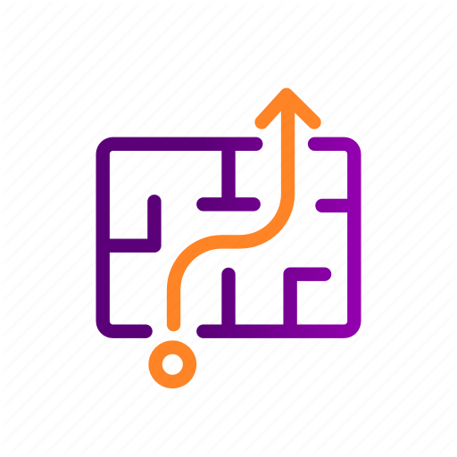

<!-- PROJECT LOGO -->
 

  

  <h3 align="center">Pathfinding Visualizer</h3>

  

    A pathfinding visualizer project to find the shortest path between 2 nodes!
  

<!-- ABOUT THE PROJECT -->
## About The Project

In this project I have impemented a small pathfinder using only python3. Path finding is finding the shortest route between 2 points. One of the most popular pathfinding algorithms is the Dijkstra's algorithm. This algorithm begins with a start node and an open set of candidate nodes.  At each step, the node in the open set with the lowest distance from the start is examined. The node is marked "closed", and all nodes adjacent to it are added to the open set if they have not already been examined. This process repeats until a path to the destination has been found. Since the lowest distance nodes are examined first, the first time the destination is found, the path to it will be the shortest path. The code can be seen [here](https://github.com/amijeet/Pathfinder/blob/master/path_finder_clone.py).

[![Product GIF][product-GIF]](https://example.com)

<!-- USAGE EXAMPLES -->
## How to use

The first click anywhere creates the start node, the second click anywhere will create the end node. Now click and drag to draw walls. Now press the spacebar to find the shortest route between the start node and the end node, avoiding walls drawn by the user.

<!-- CONTACT -->
## Contact

Amijeet Thakur - [amijeetthakur@gmail.com](mailto:amijeetthakur@gmail.com)

Project Link: [https://github.com/amijeet/Pathfinder](https://github.com/amijeet/Pathfinder)

<!-- MARKDOWN LINKS & IMAGES -->

[product-GIF]: images/pathfinderDemo.gif
